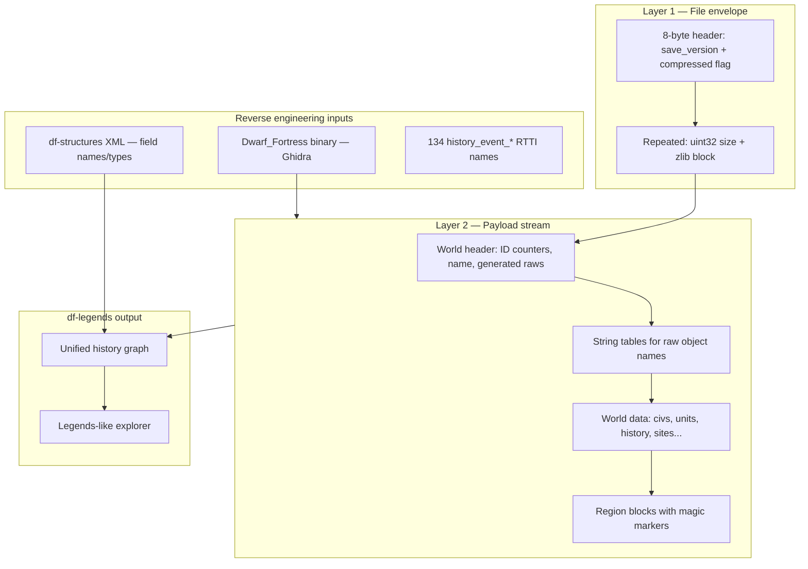

# Path C: Native Save Parser via Binary Reverse Engineering

How we build a **standalone Dwarf Fortress save deserializer** by analyzing the
game binary, without running DF or DFHack at parse time.

**Target:** DF 0.47.05 (`save_version` **1716**). For current status, paths,
and the definitive findings, read [`../AGENTS.md`](../AGENTS.md). For the save
file formats see [`save-formats-0.47.05.md`](save-formats-0.47.05.md); for
empirical layouts see
[`../tools/df-save-re/docs/binary-re-findings-0.47.05.md`](../tools/df-save-re/docs/binary-re-findings-0.47.05.md).

**End goal:** Read `world.sav` / `world.dat` and reconstruct the same
world-history graph that Legends mode displays: figures, events, sites,
entities, artifacts, eras, relationships.

## Why this is hard

DF saves are not self-describing archives. They are a **serialized object
graph** written by hundreds of version-aware
`read_file(file_compressorst&, loadversion)` methods in the closed
`Dwarf_Fortress` binary.

Layer 1 (file envelope) is simple. Layer 2 (typed payload) has:

- No chunk type IDs at the top level (except occasional magic strings like
  `*START REGION SAVE*`)
- Polymorphic types (`history_event_*` has 134 distinct subclasses in 0.47.05)
- Version branches inside nearly every deserializer (`if (loadversion >= X)`)
- Pointer encoding via `save_posnull_pointer` / `load_posnull_pointer`

DFHack's **df-structures** documents the **in-memory C++ layout** after
deserialization. It does **not** generate file parsers and does **not** match
the on-disk stream (pointers become ids, some fields are omitted, some unions
are discriminated on disk). Path C means bridging that gap ourselves — the
binary is the source of truth, not the XML.

## Architecture

## Reverse engineering workflow

1. **Decompile** each type's `read_file` / `write_file` with the Ghidra
   pipeline in `tools/df-save-re/ghidra_scripts/` (see its README). The
   decompiled C is committed to `tools/df-save-re/ghidra_decompiles/`.
2. **Record the real on-disk field order** (especially reference fields written
   as ids, version-gated fields, discriminated unions) as parser overrides in
   the engine (`body_skipper.py` special cases + `polymorph.py` dispatch).
3. **Validate** with the self-validating harness: a layer is correct when
   `walk_pointer_vector` returns `ok=True and landed_on_anchor=True` and the
   parsed count equals the header `max_ids`.
4. **Persist** landed records in `db/store.py` and surface them in the explorer.

## Prior art

| Source | Use for |
|--------|---------|
| [Andux format research](https://dwarffortresswiki.org/index.php/User:Andux/Format_research) | World header, region blocks, string tables |
| [Rick save research](https://www.dwarffortresswiki.org/index.php/User:Rick/Save_research) | Block-level maps (older but structurally similar) |
| [df-structures](https://github.com/DFHack/df-structures) | Field names, types, ref-targets |
| [exportlegends.lua](https://github.com/DFHack/df-structures) | Which memory fields matter for legends |
| [apoco/dfparse](https://github.com/apoco/dfparse) | Premium DF RE approach (newer binary, same problem) |
| [Arch Cloud Labs DF RE](https://www.archcloudlabs.com/projects/dwarfortress/) | zlib block extraction methodology |

## Version strategy

| Decision | Recommendation |
|----------|----------------|
| First target | **0.47.05** (`save_version` 1716) — we have the binary |
| Next target | **v53 Classic** — current Bay12 release, different `save_version` scheme |
| Cross-version parser | Not feasible as one codebase; dispatch on `save_version` like DF itself |

Each DF release that changes memory layout also changes save layout. Budget
RE time per major version, same as DFHack.

## Success criteria

Path C is "working" when `df-save-re extract <world.dat> --json` produces a
queryable graph with all figures + civ affiliations, all events (or parity with
vanilla `legends.xml`), sites, entities, and artifacts — no running DF process.

| Milestone | Value |
|-----------|-------|
| Layer 1 decompress | Required foundation ✅ |
| World header + name | Save identification ✅ |
| Generated raws extraction | Modding utility ✅ |
| Region map blocks | Geography visualization ✅ |
| History events + figures | **Core legends timeline** — pending (see AGENTS.md §5) |
| Full parity with legends.xml | Production-ready |
