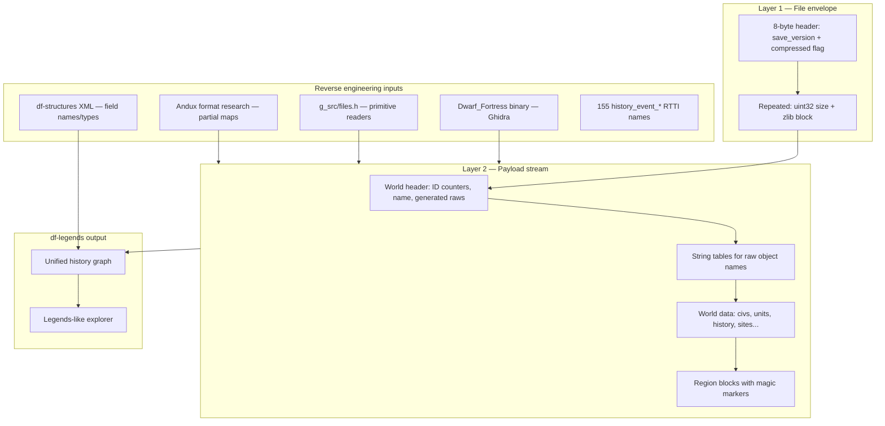

# Path C: Native Save Parser via Binary Reverse Engineering

This document describes how to build a **standalone Dwarf Fortress save deserializer** by analyzing the game binary, without running DF or DFHack at parse time.

**Target:** DF 0.47.05 Linux 64-bit (`save_version` **1716**) — the tarball we have locally at `research/df_extract/df_linux/`.

**End goal:** Read `world.sav` / `world.dat` and reconstruct the same world-history graph that Legends mode displays: historical figures, events, sites, entities, artifacts, eras, relationships.

---

## Why this is hard

DF saves are not self-describing archives. They are a **serialized object graph** written by hundreds of version-aware `read_file(file_compressorst&, loadversion)` methods in the closed `Dwarf_Fortress` binary.

Layer 1 (file envelope) is simple. Layer 2 (typed payload) has:

- No chunk type IDs at the top level (except occasional magic strings like `*START REGION SAVE*`)
- Polymorphic types (`history_event_*` has **155** distinct subclasses in 0.47.05)
- Version branches inside nearly every deserializer (`if (loadversion >= X)`)
- Pointer encoding via `save_posnull_pointer` / `load_posnull_pointer`

DFHack's **df-structures** documents the **in-memory C++ layout** after deserialization. It does **not** generate file parsers. Path C means bridging that gap ourselves.

---

## Architecture overview



---

## Layer 1: File envelope (DONE)

Implemented in `tools/df-save-re/`.

| Offset | Type | Field |
|--------|------|-------|
| 0 | uint32 LE | `save_version` (1716 for 0.47.05) |
| 4 | uint32 LE | `is_compressed` (1 = yes) |
| 8+ | repeated | `uint32 compressed_size` + zlib data |

Primitive serialization (from open-source `g_src/files.h`):

| Type | On-disk format |
|------|----------------|
| int32 / int16 | little-endian, byte-swapped in code |
| bool | int8 (0/1) |
| string | int16 length + bytes |
| vector | int32 count + elements |

```bash
cd tools/df-save-re && pip install -e .
df-save-re inspect /path/to/region1/world.dat
df-save-re decompress /path/to/world.dat -o /tmp/payload.bin
df-save-re scan /path/to/world.dat
```

---

## Layer 2: Payload layout (IN PROGRESS)

### Known landmarks (Andux + binary strings)

After decompression, `world.dat` for a retired world roughly follows:

1. **World header** — ID counters (max histfig ID, max event ID, etc.), optional world name
2. **Generated raws** — MATERIAL/ITEM/CREATURE/INTERACTION string-lists (procedural forgotten beasts, etc.)
3. **String tables** — 19–20 sections of raw object name lists
4. **World data** — entity lists, historical figures, history events, sites, artifacts…
5. **Region blocks** — delimited by magic strings:
   - `*START REGION SAVE*`
   - `*START REGION DIM SAVE*`
   - `*START REGION MAP SAVE*`
   - `*START REGION GEOLOGY SAVE*`
   - `*START REGION SUBREGION SAVE*`

`world.sav` (active fort/adventure) embeds the same world blob **plus** additional fort/adv state appended or interleaved — parse fort saves after mastering `world.dat`.

### History data model (from df-structures + exportlegends)

Primary structures to RE (see `df.history.xml`, `df.world.xml` on GitHub):

| Structure | Legends relevance |
|-----------|-------------------|
| `world_history` | Container for events, figures, eras |
| `history_event` (+ 155 subclasses) | Timeline entries |
| `historical_figure` | People, rulers, beasts |
| `historical_entity` | Civilizations, groups |
| `world_site` | Forts, towns, ruins |
| `artifact_record` | Artifacts |
| `identity` | False identities (vampires, etc.) |

RTTI type list for 0.47.05 extracted to `data/df_47_05_history_event_types.txt` (155 types).

Each polymorphic `history_event` deserialize typically:

1. Reads a type tag or vtable index
2. Dispatches to subclass `read_file`
3. Reads common fields (year, coords, entity refs) then subclass-specific fields

---

## Reverse engineering workflow (Ghidra)

### Setup

1. Install [Ghidra](https://ghidra-sre.org/) locally (not available in this cloud VM).
2. Import `research/df_extract/df_linux/libs/Dwarf_Fortress` as **ELF x86-64**.
3. Enable analysis; demangle Itanium C++ symbols.
4. Import `g_src/files.cpp` / `files.h` as source correlation (open-source compressor matches binary).

### Phase 1 — Find the load entry point

Search defined strings in Ghidra:

| String | Purpose |
|--------|---------|
| `data/save/current/world.sav` | Save path construction |
| `data/save/current/world.dat` | Retired world path |
| `CULL_HISTORICAL_FIGURES` | History maintenance |
| `*START REGION SAVE*` | Region block writer/reader |

From save-path strings, xref upward to find:

- `world::read_file(file_compressorst&, loadversion)` (or equivalent)
- Top-level load sequence that reads header counters + generated raws

**DFHack gdb workflow** (when you have a real save + DF running):

```bash
cd /path/to/df_linux
./dfhack -g
# In gdb: break on file_compressorst::open_file, run, load save, backtrace
```

The bundled `dfhack` launcher supports `-g` / `--gdb` with `LD_PRELOAD` already configured.

### Phase 2 — Map primitive readers

`file_compressorst::read_file` symbols confirmed in 0.47.05 binary:

```
_ZN17file_compressorst9read_fileERSs   (string)
_ZN17file_compressorst9read_fileEPvl   (raw bytes)
_ZN17file_compressorst9read_fileE...   (int32, int16, bool overloads)
```

In Ghidra, mark these and use **Function Call Trees** from any `read_file` method on history types to see field read order.

### Phase 3 — Trace `history_event` dispatch

1. Search demangled symbols containing `history_event_`
2. For each subclass, locate `read_file(file_compressorst&, long)`
3. Record field sequence as pseudocode
4. Cross-reference field names with `df-structures` XML (`df.history.xml`)

Example mapping template (fill in per subclass):

```
history_event_war_attacked_site::read_file:
  read base history_event fields
  read int32 attacker_civ_id
  read int32 defender_site_id
  ...
```

### Phase 4 — Validate incrementally

For each structure decoded:

1. Implement Python reader in `df_save_re/deserializers/`
2. Run against a **real save** at the known file offset (from Ghidra breakpoint or marker scan)
3. Compare object counts against DFHack console:
   ```
   lua -e 'print(#df.global.world.history.events)'
   ```
4. Compare a sample of events against `legends.xml` export for the same world

**We need a test save.** Generate a small world in 0.47.05, retire it (produces `world.dat`), add to `tests/fixtures/` (gitignored if large).

### Phase 5 — Build the history graph

Once `world_history`, `historical_figure`, and `history_event` deserialize:

- Resolve ID references (histfig_id → figure object)
- Build indexes: by year, by site, by entity
- Expose same query surface as Legends mode

---

## Tools in this repo

| Path | Purpose |
|------|---------|
| `tools/df-save-re/` | Layer 1 decompressor, scanner, binary primitives |
| `tools/df-save-re/scripts/extract_rtti_types.py` | Extract RTTI names from binary |
| `data/df_47_05_history_event_types.txt` | 155 event subclass names |
| `research/df_extract/` | Local DF 0.47.05 install (gitignored) |
| `research/dfhack_extract/` | DFHack scripts/docs reference |

---

## Prior art to steal from

| Source | Use for |
|--------|---------|
| [Andux format research](https://dwarffortresswiki.org/index.php/User:Andux/Format_research) | World header, region blocks, string tables |
| [Rick save research](http://www.dwarffortresswiki.org/index.php/User:Rick/Save_research) | Block-level maps (older but structurally similar) |
| [df-structures](https://github.com/DFHack/df-structures) | Field names, types, ref-targets |
| [exportlegends.lua](../research/dfhack_extract/hack/scripts/exportlegends.lua) | Which memory fields matter for legends |
| [apoco/dfparse](https://github.com/apoco/dfparse) | Premium DF RE approach (newer binary, same problem) |
| [Arch Cloud Labs DF RE](https://www.archcloudlabs.com/projects/dwarfortress/) | zlib block extraction methodology |

---

## Version strategy

| Decision | Recommendation |
|----------|----------------|
| First target | **0.47.05** (`save_version` 1716) — we have the binary |
| Next target | **v53 Classic** — current Bay12 release, different `save_version` scheme |
| Cross-version parser | Not feasible as one codebase; use `save_version` dispatch like DF itself |

Each DF release that changes memory layout also changes save layout. Budget **RE time per major version**, same as DFHack.

---

## Immediate next steps

1. **Obtain a small test save** (0.47.05, retired world → `world.dat`).
2. Run `df-save-re inspect` and `df-save-re scan` on it; record marker offsets.
3. **Ghidra session:** trace load from `*START REGION SAVE*` backward to world header; document first 256 bytes field-by-field.
4. Implement `WorldHeader` reader in Python; validate ID counters order of magnitude vs DFHack.
5. Pick **one simple event type** (e.g. `history_event_created_site`) — full RE → Python → validate against legends export.
6. Expand event dispatch table using `data/df_47_05_history_event_types.txt`.

---

## Success criteria

Path C is "working" when `df-legends` can:

```bash
df-legends parse-save /path/to/region1/world.dat --format json
```

…and produce a queryable graph with:

- All historical figures and their civ affiliations
- All historical events (or parity with vanilla `legends.xml`)
- Sites, entities, artifacts
- No running DF process

Partial success milestones:

| Milestone | Value |
|-----------|-------|
| Layer 1 decompress | Required foundation ✅ |
| World header + name | Save identification |
| Generated raws extraction | Modding utility |
| Region map blocks | Geography visualization |
| History events | **Core legends timeline** |
| Full parity with legends.xml | Production-ready |
