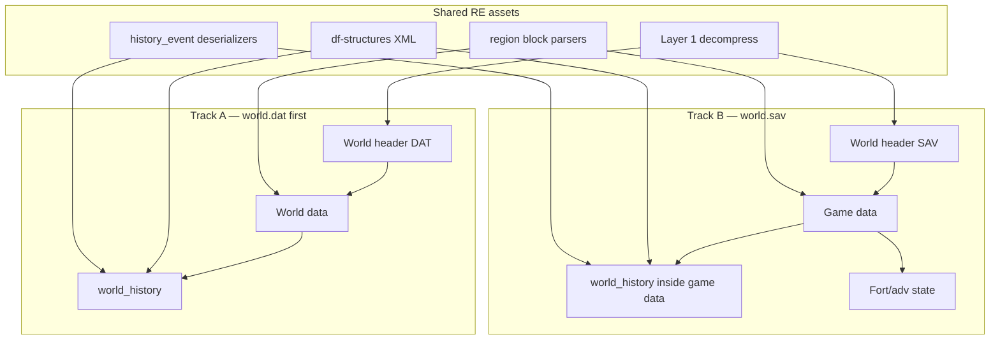

# Save formats — DF 0.47.05

Two primary world blobs live in each region folder. Sidecar files hold offloaded detail.

## Region folder layout

```
region1/
├── world.dat          # retired / no active fort or adventurer
├── world.sav          # active fortress or adventure (replaces world.dat while playing)
├── site-3.dat         # map of a retired/abandoned fort
├── unit-12.dat        # offloaded historical figure detail
├── feature-0-1.dat    # local map features (caverns, HFS, …)
├── region_snapshot-2.dat
└── *world_gen_param*.txt
```

Source: [Saved game folder](https://dwarffortresswiki.org/index.php/Saved_game_folder), [Andux format research](https://dwarffortresswiki.org/index.php/User:Andux/Format_research).

## File envelope (both `world.dat` and `world.sav`)

Same Layer 1 wrapper for all Bay12 compressed saves since 0.31:

| Offset | Field |
|--------|-------|
| 0 | `save_version` (1716 for 0.47.05) |
| 4 | `is_compressed` |
| 8+ | zlib blocks |

## Divergence: payload layout

Andux documents **different** top-level structures after decompression:

| Section | `world.dat` | `world.sav` |
|---------|-------------|-------------|
| After envelope | [World header (DAT)](https://dwarffortresswiki.org/index.php/User:Andux/Format_research/WORLD.DAT) | [World header (SAV)](https://dwarffortresswiki.org/index.php/User:Andux/Format_research/WORLD.SAV) — **different field layout** |
| Generated raws | yes | yes (beast defs) |
| String tables | yes | yes |
| Main body | **World data** (regions, history, sites, …) | **Game data** (live fort/adv + embedded world state) |

**Important:** you cannot assume the same `WorldHeaderHypothesis` at offset 8 for both files. Retired-world RE from `world.dat` informs history structures, but `world.sav` needs its own header RE and a **Game data** parser.

## What df-legends needs from each

### Legends layer (primary goal)

Data for Legends-like exploration:

- `world_history` — events, figures, eras, collections
- Sites, entities, artifacts (world-level)
- Region geography blocks (`*START REGION …*` markers)

This lives in **World data** (`world.dat`) and is also present inside active saves, but reached through the `world.sav` **Game data** path (exact offset TBD via RE + your test saves).

### Active layer (secondary goal)

Only in `world.sav` **Game data**:

- Live map tiles, buildings, items, units
- Fort/adventure UI state, jobs, stockpiles
- Not required for world-history timeline, but required for full “parse active save”

Sidecars (`site-*.dat`, `unit-*.dat`) add detail for retired forts and offloaded units without replacing the main world blob.

## Parsing strategy (two tracks)



### Recommended order

1. **`world.dat`** — validate world header, history, region blocks (simplest path to Legends data).
2. **`world.sav`** — RE Game data entry; locate `world_history` (likely same in-memory layout as DAT, different file offset).
3. **Sidecars** — `site-*.dat` / `unit-*.dat` when you need map or unit detail beyond legends.

### Test fixtures (when available)

| Fixture | Purpose |
|---------|---------|
| `tests/fixtures/region-retired/world.dat` | Track A — legends parsing |
| `tests/fixtures/small-retired/world.dat` | Track A — compact Namushul world (fast tests) |
| `tests/fixtures/waterlures-retired/world.dat` | Track A — DFFD Waterlures / Minbazkar (larger) |
| `tests/fixtures/region-active/world.sav` | Track B — Game data + legends inside active save |
| Same world retired then loaded | Compare history counts between DAT and SAV |

## CLI

```bash
cd tools/df-save-re
python3 scripts/fetch_fixtures.py    # downloads Waterlures world.dat
python3 -m pytest
df-save-re folder /path/to/region1
df-save-re probe tests/fixtures/waterlures-retired/world.dat
```
